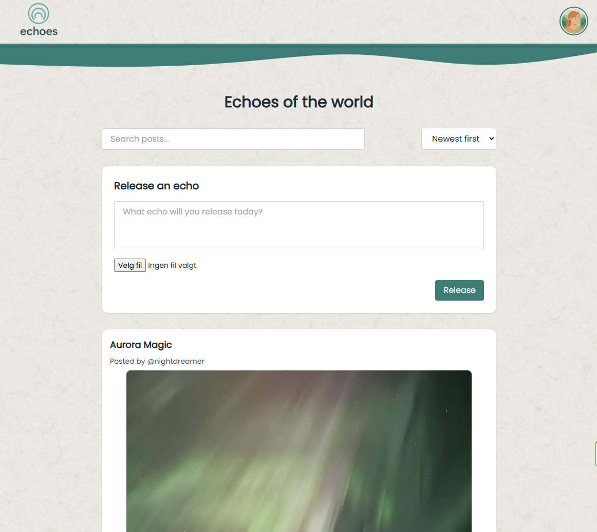

# Echoes 🌿

**Echoes** is a calm, minimal social media platform where users can share short thoughts, moments, and reflections from nature.  
Built with Tailwind CSS, SASS, and vanilla JavaScript.

## 📸 Screenshot from the feed
  

## 📸 Screenshot from the profile


## ✨ Features

- ✅ Login and register forms with validation
- ✅ Choose and save your profile avatar
- ✅ Responsive and mobile-friendly design
- ✅ Pre-filled test user (`adventureseeker`) for easy login ( username: adventure@echoes.com pw: naturelover )
- ✅ LocalStorage support for avatar selection

## 🛠 Prerequisites

- [Node.js](https://nodejs.org/) (v20+)
- npm (comes with Node.js)

## 🚀 Getting Started

### Installation

Install all project dependencies:

```bash
npm install
```

### Running the project (development mode)

Start the development server with live updates:

```bash
npm run dev
```


## 📜 Available Scripts

| Script             | Description                    |
| ------------------ | ------------------------------ |
| `npm run dev`       | Start development server       |
| `npm run build`     | Build production-ready files   |

## 🧰 Technologies Used

- HTML
- Tailwind CSS
- SASS
- JavaScript
- Node.js tooling (npm, concurrently)
- ChatGPT for images and "rubber duck"

## 👤 Author

Lilly-yy


# 🌟 Thank you for visiting Echoes!
